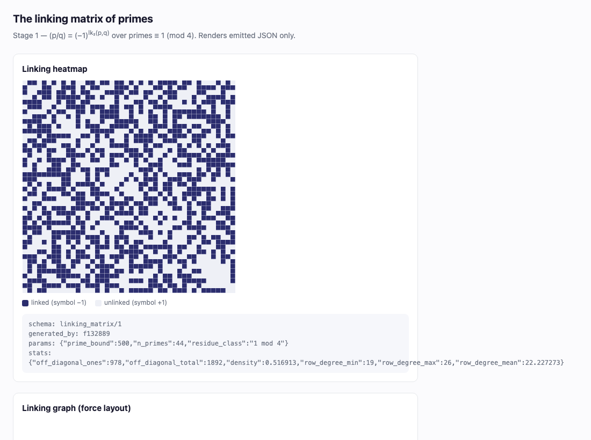
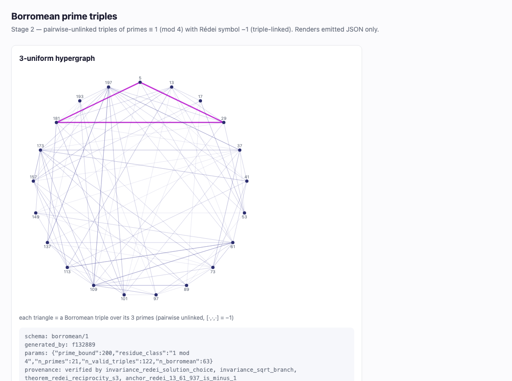
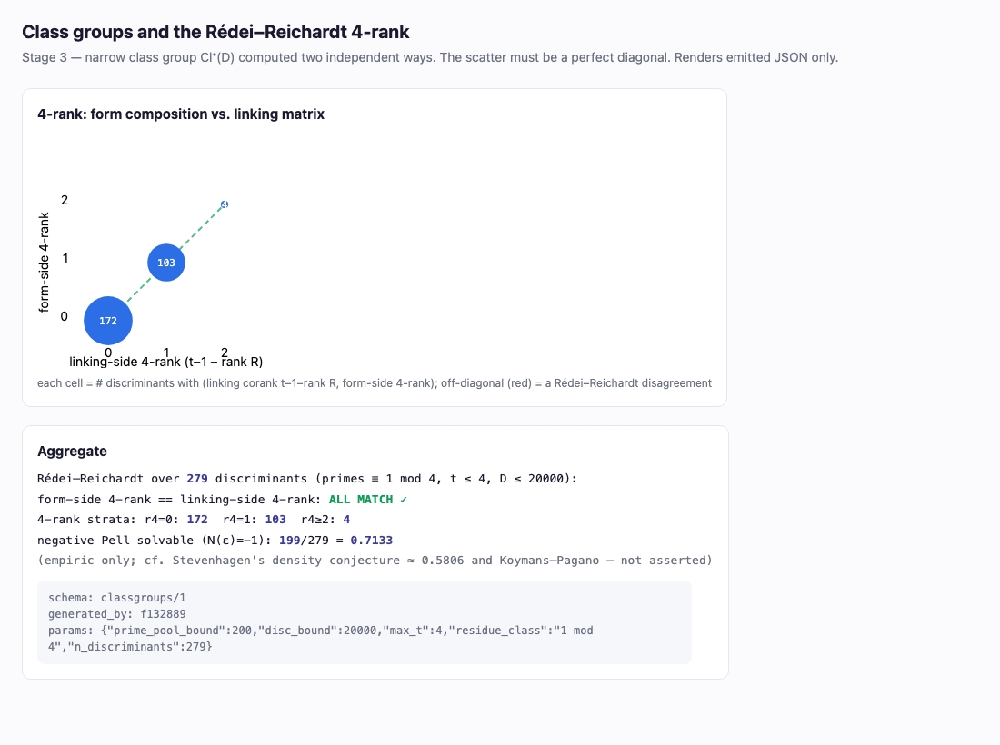
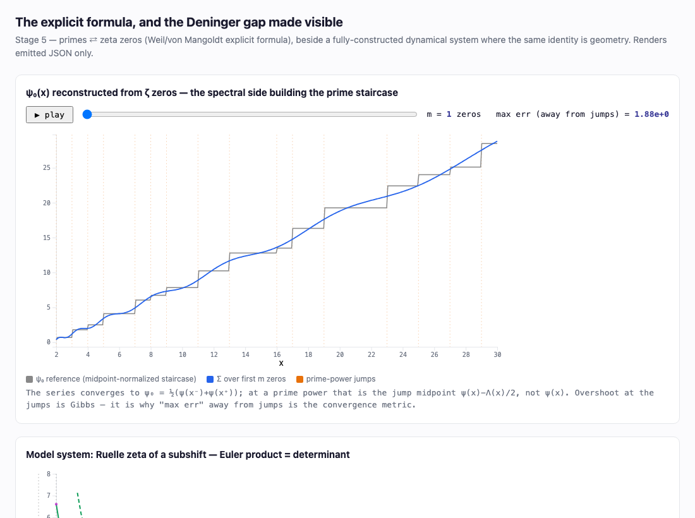

# primeknots

[](https://github.com/DerekMarshall/primeknots/actions/workflows/ci.yml)
&nbsp;·&nbsp; [](https://doi.org/10.5281/zenodo.21438900)
&nbsp;·&nbsp; from-scratch C++20 &nbsp;·&nbsp; 125 verification tests, 0 failing &nbsp;·&nbsp; [MIT](LICENSE)

**▶ [Explainer deck (live, with embedded viewers)](https://derekmarshall.github.io/primeknots/docs/deck/index.html)** · [PDF](docs/deck/deck.pdf) · [the error ledger](docs/ERRATA.md)

**Arithmetic topology, executable.** A from-scratch, dependency-free C++ suite that
*verifies* — not just states — the theorem chain running from quadratic reciprocity
(as linking symmetry) through Rédei symbols (triple Milnor invariants, Borromean
primes) and the Rédei–Reichardt 4-rank theorem (linking controls homology) to the
abelian arithmetic Chern–Simons partition function (linking determines the TQFT),
the Weil explicit formula (the orbit/spectrum duality), and non-abelian S₃
Dijkgraaf–Witten counting (gauge theory as cubic-field tabulation). Every result is
computed two independent ways or refereed by an external oracle; visualizations are
emitted as JSON and rendered by static D3 viewers.

No new mathematics: every theorem here is known (Gauss 1801 through Stevenhagen
2022). The output is the verification, the tables, and the method.

The name `primeknots` is an origin homage — the knots-and-primes analogy of arithmetic
topology — kept deliberately as the project grew past it (into elliptic-curve murmurations and
more); it is a starting point, not a scope claim (CLAUDE.md rule 7).

## Gallery

Each panel is rendered by a static viewer from emitted JSON only (`./build/bin/at
emit --stage N`; sources in `viz/`).

| | |
|---|---|
| <br>**Stage 1 — reciprocity is linking symmetry.** The prime linking matrix `(p/q) = (−1)^{lk₂(p,q)}` is symmetric; the picture *is* quadratic reciprocity. | <br>**Stage 2 — Borromean primes.** Triples that are pairwise unlinked yet triple-linked (Rédei symbol `[a,b,c] = −1`) — the arithmetic mod-2 triple Milnor invariant. |
| <br>**Stage 3 — Rédei–Reichardt 4-rank.** The 4-rank of the narrow class group computed on the *form* side equals the `F₂`-rank of the linking matrix on the *linking* side — agreement on the diagonal over 10³ discriminants. | <br>**Stage 5 — the Weil explicit formula & the Deninger gap.** ψ(x) rebuilt from ζ zeros, beside a fully-constructed subshift flow where the same Euler-product = determinant identity *is* geometry — and arithmetic, where it is not. |

## The stages — arithmetic topology

| Stage | Object / theorem verified | Tests |
|---|---|---|
| 0 | Primitives; quadratic reciprocity + both supplements (exhaustive to 10⁶) | 11 |
| 1 | The linking matrix of primes ≡ 1 (mod 4); reciprocity = symmetry | 9 |
| 2 | Rédei symbols, Rédei reciprocity (S₃ symmetry), Borromean triples | 10 |
| 3 | Class groups as H₁; the Rédei–Reichardt 4-rank (form-side vs linking-side) | 8 |
| 4 | The abelian arithmetic Chern–Simons / Dijkgraaf–Witten partition function | 4 |
| 5 | Weil explicit formula; Riemann–Siegel zeros (Turing-certified); model flow | 13 |
| 6 | Non-abelian S₃ Dijkgraaf–Witten counting vs cubic-field tabulation | 8 |
| | **total** | **63** (10 oracle-refereed) |

All green; stage gates are strict — nothing builds on a stage whose suite isn't.

## The M-ladder — elliptic-curve murmurations

A second, independent track (spec [`docs/RESEARCH-M.md`](docs/RESEARCH-M.md), engineering
[`docs/ARCHITECTURE-M.md`](docs/ARCHITECTURE-M.md)) replicates *murmurations* — the oscillating
correlation between Frobenius traces `a_p` and root numbers of elliptic curves, discovered in
2022 — from scratch, under the same discipline. Two modes, never blurred: replication (M0–M4)
and pre-registered research (M5). No proofs are claimed (rule 7).

| Stage | Object replicated | Tests |
|---|---|---|
| M0 | `a_p` machinery + data provenance (char-sum referee, O(p) fast path, Shanks–Mestre O(p^{1/4}) twin) | 9 |
| M1 | The murmuration, replicated (the 2022 discovery) | 3 |
| M2 | Dirichlet characters, fully from scratch | 6 |
| M3 | Zubrilina's murmuration density (the crown replication) | 16 |
| M4 | Sawin–Sutherland height-ordered density (a conjectured density + a proven variant) | 13 |
| M5 | Research mode — a pre-registered height-family study | 13 |
| M5 gate | 2¹⁸ `a_p` twin + oracle spot (heavy, compute-box only) | 2 |
| | **total** | **62** |

The M5 write-up is **[the data note](docs/notes/data-note/data-note.md)** (`docs/notes/data-note/`).
Across both ladders: **125 verification tests** (63 + 62), plus 4 infrastructure guards (freshness,
JSON-schema, deck, explainers, constants) = 129 ctest targets, **17 oracle-refereed**.

## Method — how the numbers are checked

The discipline is in [`CLAUDE.md`](CLAUDE.md). The load-bearing rules:

1. **Never fit conventions to expected answers.** If a published anchor comes out
   wrong, the bug is in the code or in our reading of the source — go fix the
   reading, never flip a sign until the number appears.
2. **Dual implementation before trust.** Every load-bearing function has two
   independent algorithms, or an external oracle (PARI/GP, the Odlyzko zero table,
   Belabas's cubic enumerator). "A result computed one way is a rumor."
3. **Oracles referee, never replace** — and SKIP *visibly* (never a silent pass)
   when absent. CI runs a fast **smoke subset** (core arithmetic, one M-stage, and
   the freshness guard) so every branch push is refereed in minutes; the full suite
   runs locally and on the compute box. In CI the oracle tests SKIP, the rest green.
4. **Flag, don't smooth.** Ambiguities and source discrepancies are recorded, not
   quietly resolved to whatever makes tests pass.

Every party that touched the project — roadmap generator, LLM assistant, spec
author, human reviewer, coding agent, external referees — was caught in at least one
error, each by a witness value, an exhaustive sweep, an algebraic identity, a parity
argument, an oracle cross-check, or a verbatim quote, never by an argument from
authority. The record is **[`docs/ERRATA.md`](docs/ERRATA.md)**.

This is n=1 — one project, one problem class, one operator: an existence proof that
the discipline can be applied, not evidence that it generalizes.

## Build, test, run

```bash
cmake -B build -DCMAKE_BUILD_TYPE=Release
cmake --build build -j
ctest --test-dir build --output-on-failure        # full suite (125 verification tests); oracle tests SKIP if gp/data absent
ctest --test-dir build -L m4                       # one stage (labels: stage0..stage6, m0..m5, oracle)
./build/bin/at emit --stage 1 --out viz/data       # emit JSON for the viewers
python3 -m http.server -d viz                      # view at localhost:8000
```

C++20, core dependency-free (`__int128` built-ins); GMP only behind a facade where a
stage needs it. Test framework: doctest (vendored). Oracles (PARI/GP, Odlyzko table,
Belabas `cubic`) are optional — their tests SKIP cleanly when the tool or data is
absent, e.g. in CI.

## Layout & specs

- **Explainers** (prerequisite-free, prose): [`E1 — murmurations`](docs/explainers/E1-murmurations.md), [`E2 — primeknots`](docs/explainers/E2-primeknots.md), [`E3 — method`](docs/explainers/E3-method.md); every claim sourced in [`CLAIMS-E.md`](docs/explainers/CLAIMS-E.md).
- [`docs/RESEARCH.md`](docs/RESEARCH.md) — the mathematics, stage by stage, with normative sources.
- [`docs/ARCHITECTURE.md`](docs/ARCHITECTURE.md) — modules, types, the JSON/viewer contract, acceptance criteria.
- [`docs/RESEARCH-M.md`](docs/RESEARCH-M.md) / [`docs/ARCHITECTURE-M.md`](docs/ARCHITECTURE-M.md) — the M-ladder (murmurations): mathematics + engineering.
- [`docs/notes/`](docs/notes/) — per-stage pinning logs and resolved discrepancies; [`docs/notes/data-note/`](docs/notes/data-note/) — the M5 data note.
- [`docs/ERRATA.md`](docs/ERRATA.md) — the error ledger.
- `src/` core → symbols → linking → redei → classgroup → cs → zeta → dw, plus the M-ladder — ell (elliptic curves / `a_p`) · mform (modular forms) · murm (murmurations); `verify/` the point of the repo; `oracle/` referees; `viz/` viewers.
